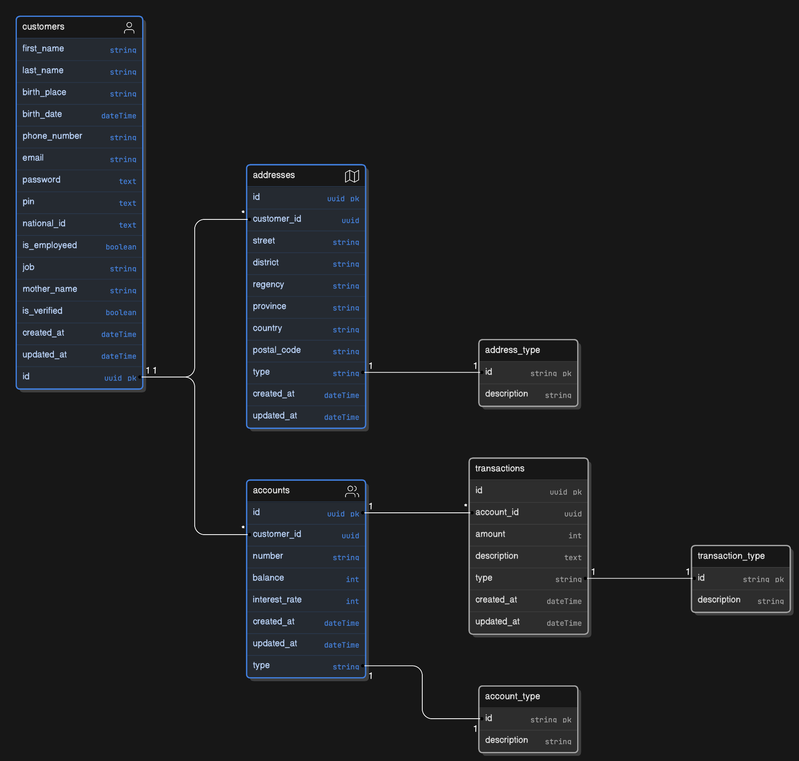

## SETUP

This SQL program use to make data for Customers that has One-to-Many relationships with Addresses and Accounts table. 

Addresses has One-to-One relationship with Address_type, also Accounts with Account_type table.  

Accounts table has One-to-Many relationship with Transactions Table. Same like Addresses and Accounts table, Transactions table has One-to-One relationship with Transaction_type table.  

> __IMPORTANT!!!__  
> identifier (id) in Customers, Addresses, Accounts and Transactions using UUID as identifier. PostgreSQL database uses UUID generator function to generate unique identifier.

$~$

## Entity Relational Diagram (ERD)
